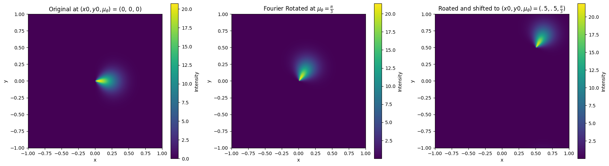
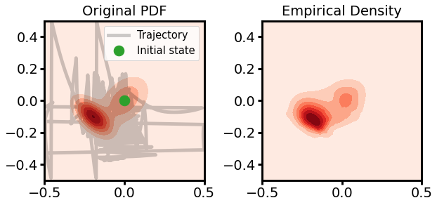
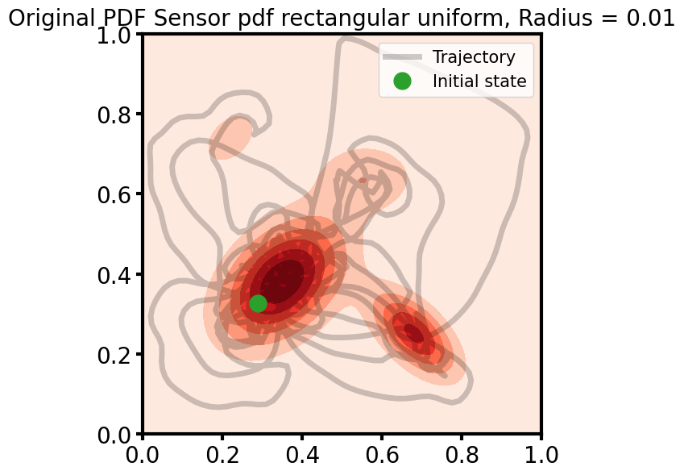
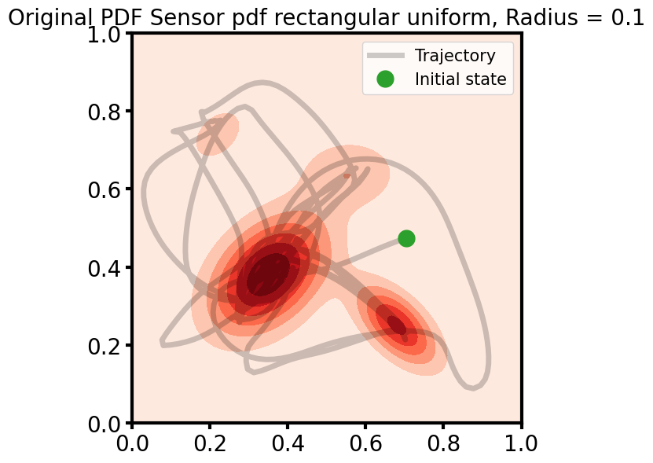
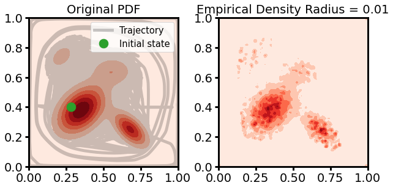
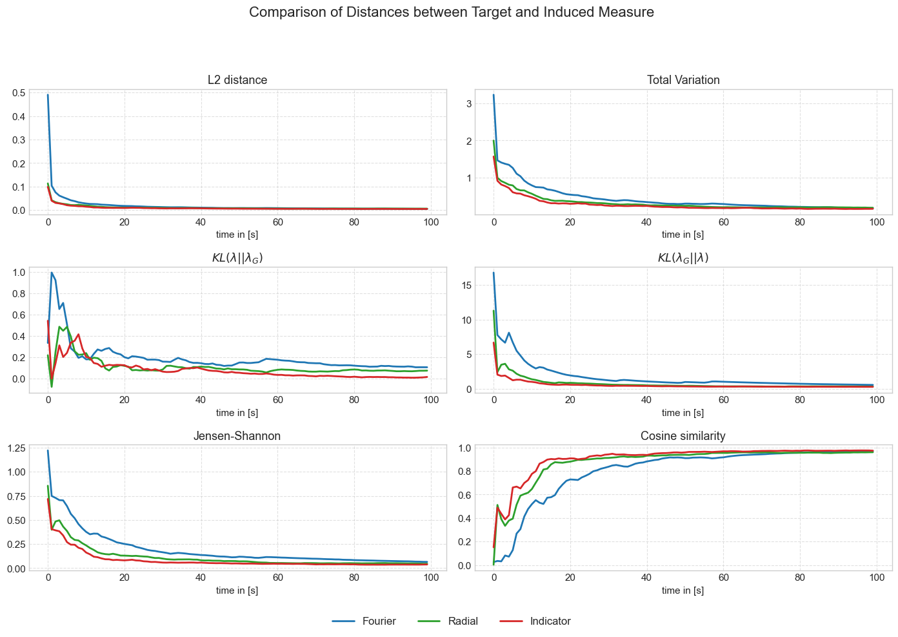

## Overview

This repository presents novel approaches based on the **ergodicity metric** introduced in the paper:

> **"Metrics for Ergodicity and Design of Ergodic Dynamics for Multi-Agent Systems"**  
> George Mathew and Igor Mezić  
> [Read the paper](https://www.sciencedirect.com/science/article/abs/pii/S016727891000285X?fr=RR-2&ref=pdf_download&rr=9442fb44dae4e522)

These methods extend ergodic control techniques for trajectory optimization and spatial coverage, with potential applications in robotics, exploration, and autonomous systems.

---

### Acknowledgements

Some portions of the code are adapted from:

- [MurpheyLab/ergodic-control-sandbox](https://github.com/MurpheyLab/ergodic-control-sandbox)

---

### Notebooks Overview

#### 🌀 Ergodic Metric Optimization (FFT-based)
- `SMC_ergodic_control_FFT.ipynb` 
Explores ergodic control with complex sensor measures that do not admit a symbolic form under the set of measure-determining linear functionals.
    
  

#### 📡 Alternative Sensor Measures
- `smc_ergodic_sensor_distributions.ipynb`
Focuses on simpler sensor measures that do admit symbolic representation, allowing for more interpretable analysis and efficient computation.
    
  

#### 🚗 Ergodicity Under Unicycle Model
- `smc_ergodic_unicycle.ipynb` 
Applies ergodic control to a unicycle model, demonstrating performance under non-holonomic dynamics with basic sensor assumptions.
  

#### 🔢 Different Basis Function Sets
- `smc_ergodic_different_basis.ipynb`
Compares different sets of measure-determining linear functionals to assess their impact on the ergodic metric and control performance.

## 📬 Contact
**Author:** Justus Prass  
📧 Email: justus.prass@web.de  
🐙 GitHub: [@justus-ui](https://github.com/justus-ui)  